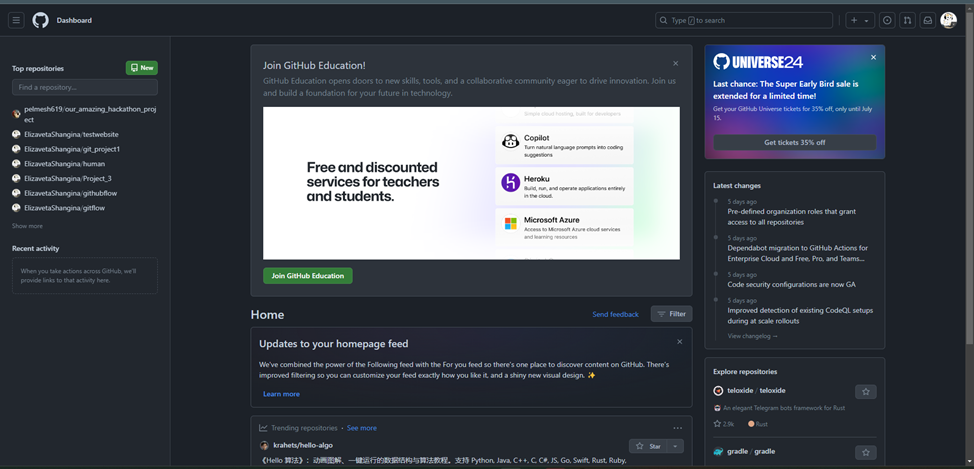

# Test
## Создание репозитория
Самый первый шаг. Создаем новый репозиторий (реально, всего лишь папка с каким-то проектом), с которым дальше будем работать:
 
Собственно, настроим репозиторий. Если хочешь, чтобы потом в этот проект мог зайти кто-то еще, выбирай public, если личные заметки – private (хотя как инфобезник могу сказать, что такое вообще лучше никуда не писать). Принципиально название и аккаунт владельца, потом будем работать под ним же, особенно если репозиторий – private. Лучше поставить галочку create a ReadMe file. В нем обычно хранится описание содержимого.
 
Поздравляю, вы создали свой первый репозиторий на гит хабе)

## Добавление файлов
Теперь шаг 2: добавляем файлы. Существует 2 принципиально разных способа. Один простой, удобный, надежный, но лишает тебя всей прелести использования гитхаба. Второй – тот, ради которого, собственно, создавалась платформа. Рассмотрим оба.
### Cайт
Первый способ. Есть кнопочка add file. Щелкнув по ней, увидим меню.  
 
Щелкнув по кнопке create file получим вот такое окно. Для того, чтобы сохранить какие-то изменения, нужно назвать каким-то образом наш файл, выбрать ветку и нажать commit changes. Появляются первые термины:
> __Ветка (branch)__ – ветвь изменений – история каких-то изменений. Бывает основная (по умолчанию main, основное приложение, например) и множество параллельных (например, если идет параллельная разработка каких-то фич, которые надо оттестить и не сломать основную часть или просто в итоге не известно, будут ли их вливать в основной проект, тогда тем более его не хочется захламлять).

> Из предыдущего появляется понятие _слить ветки_ (merge request – букв. запрос на слияние)». Реально – просто собрать содержимое на какой-то версии в одну ветку. «Сливать» можно не только побочные ветки и основную, но и побочные между собой (рассмотрим где-то на восьмой странице).

> __Сделать коммит (commit)__ – сохранить изменения. Как мы помним, сам github – система контроля версий. Если что, потом именно между коммитами мы будем передвигаться, чтобы получить предыдущую версию.
И так, в новых терминах: создали файл с каким-то содержимым (можно и текстовым, важно расширение файла) и закоммитили изменения в основную ветку. 
UPD: если хочешь, чтобы файл лежал не просто в ветке, а в какой-то папке, то нужно просто прописать название этой папки, поставить слэш и написать название файла. То есть работа как с обычной файловой структурой. В нашем случае мы в итоге сохраним файл в папку Python, не удивляйся. Это не обязательно, я просто поздно вспомнила, что так тоже можно.

Теперь в ветке main 2 объекта:
 
Попробуем загрузить заранее готовый файл. Опять add file -> upload files. Попробуем заодно создать новую ветку с названием uploadedFiles. И так, просто перетаскиваем или выбираем один или несколько файлов. Внизу выберем создание новой ветки и вобьем название, после чего сохраним изменения нажав «propose changes». 
 
Переходим в следующее окно, в котором нам предлагается, собственно, определить нашу новую ветку. Сразу тебе предложат каким-то образом назвать новый pull-request. 

> __Pull request__ – запрос на вливание в проект каких-то изменений. Не непосредственное влияние, а именно проверка корректности этих изменений (нет ли конфликтов с предыдущими или параллельными версиями, например)
Обычно тут расписывают, какие были новые изменения в очередной версии.

> _Merge pull request_ – сохранение изменений из pull-запроса.

Нам сейчас это не нужно, поэтому просто возвращаемся обратно в наш репозиторий.
Поздравляю, мы создали первую побочную ветку. Теперь наш репозиторий не плоский, он расширяется в ширину. Как это увидеть? Теперь между main и uploadedFiles есть разница – последний добавленный файл есть только в побочной ветке, в main его уже нет:
  
На этом предлагаю закончить рассмотрение первого способа. Базовые навыки конечно здесь есть, можно было бы еще рассмотреть изменение файла, но, думаю, ты разберешься с этим сама, если будет нужно. Просто зайдешь в файл, поменяешь его и закоммитишь изменения. 
__UPD__: попробуем еще убрать наш файлик в папку. Насколько я понимаю, тебе все равно предстоит аккуратно сохранять файлы на гит и их там будет очень много, так что это может быть полезно. Так вот. Переходим в нашу ветку uploadedFiles, заходим в файл, который нужно переместить (у нас – sticker.webp). Теперь нам нужен вот этот неприметный серый карандашик, который позволяет изменять файлы онлайн.
 
Нажав на него, перейдем в окно редактирования. Бинарный файл редактировать нельзя, поэтому функционал слегка урезан, но то, что было нужно нам есть. Меняем название со sticker.webp на stickers/first.webp и коммитим. Еще один интересный факт: тут сразу понятно, в какой конкретно ветке ты сейчас работаешь, ее прям отдельно красиво подписали.
 
Теперь содержимое ветки выглядит вот так:
 
Вот теперь попытки работы с онлайн версией окончены. По большому счету, побочные ветки при сохранении файлов не нужны, можно работать только с веткой main и только в онлайн версии, этого функционала хватит, но вдруг было интересно, как это выглядит.

### PyСharm
Но иногда возникают чуть более сложные задачи. Не просто загрузить готовые файлы куда-то, а в режиме параллельной разработки редактировать какие-то файлы в чужом репозитории. Для этого и существует второй, основной способ.
Для начала придется подключить pycharm (idea, что угодно, с чем будешь работать. Принципиально отличаться принцип не будет) к твоей учетке на гитхабе. Для этого нужно уйти в настройки (ctrl+alt+s)-> version control -> GitHub -> вот этот плюсик и log in via GitHub… . Дальше нужно залогиниться. Если возникнут вопросы, я смогу ответить по ходу, но по идее, там просто нужно будет перейти на сам гит хаб и подтвердить, что ты это ты. В результате получишь что-то вот такое. OK и поехали дальше.
  
Теперь нужно как-то подключиться к какому-то репозиторию где-то и получить доступ к редактированию информации там. Идем в main menu -> Git -> manage remotes -> +. Предлагается ввести url и название нового проекта. Откуда взять url?  На гитхабе заходим в code -> local и копируем вот эту длинную ссылку. Вставляем. Есть принципиальный вопрос. Сейчас мы создаем новый проект в pycharm, он должен лежать в новой папке с уникальным названием. Если что просто на тебя будет громко ругаться сам pycharm. Проще всего выбрать не new project, а project from version control. Здесь тебе сразу предложат ввести ссылку на нужный проект и выбрать папку, в которой он будет храниться.
 
(мне потербовалось перезагрузить pycharm после этого, чтобы проект корректно отображался)
В идеале должны получить что-то вот такое. У нас есть 2 ветки, main и uploadedFiles, в каждой из которых отображается история изменений.
 
Познакомимся еще с одним понятием. Можно заметить, что около некоторых коммитов есть какие-то ярлыки. На самом деле, самый важный из них – __HEAD__. Он указывает на версию, с которой мы работаем в текущий момент времени. За этим нужно внимательно следить во избежание глупых ситуаций.
Для начала давай попробуем изменить файл прямо в ветке main и сохранить эти изменения. Для этого выбираем наш файл в структуре проекта и что-нибудь в нем меняем. Примечательно, что любые изменения тебе подсветят прямо сразу, а цвет файла в структуре, последняя версия которого не совпадает с последней сохраненной на гитхабе, изменится на синий:
 
Ну, допустим. Теперь хочется как-то это изменение запушить (залить) на гит.
Запушить (собрать push-запрос) – сохранить очередное изменение в системе версий.
Важно, что сначала нужно изменение сохранить (закоммитить). Для этого нужно выбрать (отмечено синим на рисунке выше) commit, выбрать файлы в структуре, изменения в которых мы и хотим сохранить и написать комментарий. Далее есть 2 варианта. Если пока заливать на сайт рано, то можно изменение просто сохранить. Если же мы хотим, чтобы эту версию увидели все, то смело выбираем commit and push (наш вариант).
 
Выпадет вот такое окно, в котором можно изменить ветку, с которой мы сейчас работаем. Внимательный читатель сейчас заметит, что, работая с веткой main на локальном устройстве, мы сейчас можем спокойно залить изменение в какую-то другую ветку. Да, это так. Поэтому нам пишут, что мы заливаемся в «оригинальную» версию: origin:main.
  
Если все хорошо, то теперь ветка main имеет такую историю изменений:
 
(Да, тут выясняется, что у меня подключена старая учетка и имя на гите изменено под попытку получить доступ к студенческому пакету всяких разных фич. Ну, зато можно увидеть, как выглядят коммиты от «разных людей». Не суть)
А что на гитхабе? Если все хорошо, то файл createdFile.py в ветке main теперь имеет такой же вид, как у нас.
 
Что ж. Давай посмотрим, что будет если создать ветку и потом слить ее с основной.
Скажем, что хотим работать с файлом createdFile.py в версии, которую когда-то скачали с гитхаба. Для этого нам нужно переставить тот самый ярлык HEAD. Что бы это сделать, нужно кликнуть правой кнопкой мыши по тому коммиту, с которым хотим работать и выбрать new branch. Я эту ветку назову “feature” (да-да, фича по английски, оказывается).
 
Теперь у нас есть локальная ветка (важно, что ярлык HEAD переместился в нее автоматически). Сделаем же вид, что разрабатываем какую-то дополнительную полезную функцию.
 
Давай запушим эту ветку на гитхаб так же, как и предыдущее изменение.
Если все хорошо, то теперь структура репозитория будет выглядеть вот так, а в истории изменений можно увидеть вот такое распрекрасное дерево (чтобы это сделать нужно просто не выбирать конкретную ветку в отображении, отмечено красным):
   
А теперь представим, что разработка этой гениальной функции закончена, все уже оттестили и теперь нужно добавить ее к основному приложению. Для этого ветки нужно слить.  Важно, что сейчас нам очень нужно переместить ярлык HEAD в ветку main. Выбираем ее в remote и нажимаем checkout. Если все верно, то на схеме желтенький ярлык перескочит вот так:
 
Дальше выбираем ветку feature в структуре репозитория нажатием правой кнопки мыши и выбираем merge origin/feature into main. Жуть и кошмар, но выясняется, что есть конфликты (это когда у тебя на одной и той же строке есть разные данные в последней версии файла в разных ветках) и эти конфликты нужно как-то решать. Можно просто сказать, что ты согласна оставить только свою или только оригинальную версию, но это не наш вариант. Мы пойдем искать компромисс. Для этого нажимаем merge. 
И да, начинаем собирать этакого франкенштейна из двух файлов. Слева и справа 2 файла, в середине результат. Ну, допустим, слепили и нажимаем apply  
(Да, кто-то скобочки потерял, я их потом добавила отдельным коммитом, извините)
Тадааам. Ветки собраны в одну, ветку main.
 
Осталось только выяснить, что все это время происходило, собственно, в репозитории. Оказывается, что последняя версия нашего файлика в main полностью совпадает с версией, которую мы и загружали, значит, все хорошо.
 
Если разбираться довольно поверхностно, то, на этом, наверное, все. Да, конечно, мы не посмотрели на cherry-pick, не посмотрели на pull-request и fetch, но, если в рамках знакомства, то этого должно хватить. И да, еще один важный пункт. С гитхабом можно работать и через консоль, но это тема для отдельного разговора. Я никогда не понимала, в чем там прелесть при наличии интерфейса, но, может быть, когда-нибудь я дойду и дополню этот «типо гайд».
